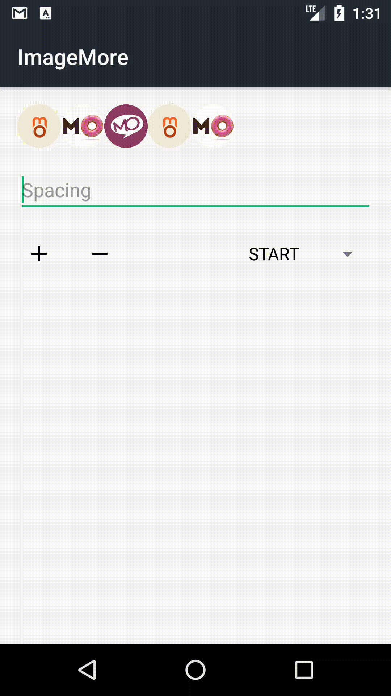

[](https://github.com/applikeysolutions/ImageMore/blob/master/LICENSE)

# ImageMore

A simple UI element for a long list of images which are not fit on screen.
This element is calculating maximum visible childs count, depending on screen size.



## Usage

Declare in your layout:

```xml
    <com.applikeysolutions.imagemore.ImageMoreView
        android:id="@+id/imageMore"
        android:layout_width="match_parent"
        android:layout_height="64dp"
        app:gravity="center"
        app:minItemSpacing="16dp" />
```

Then just add your items to adapter:

```java
        ImageMoreView<Adapter> imageMore = (ImageMoreView<Adapter>) findViewById(R.id.imageMore);
        Adapter adapter = new Adapter();
        adapter.update(items);
        imageMore.setAdapter(adapter);
```
If you want to show MoreIndicator, your adapter must implement interface ImageMoreAdapter.

```java
        class Adapter extends BaseAdapter implements ImageMoreAdapter
```

Also you can customize view programmatically:

```java
        imageMore.setMinItemSpacing(getResources().getDimensionPixelSize(R.dimen.item_spacing));
        imageMore.setGravity(Gravity.CENTER);
```

See [sample](sample/src/main/java/com/applikeysolutions/imagemore/example/ImageMoreExampleActivity.java).

License
-----

	Licensed under the Apache License, Version 2.0 (the "License");
	you may not use this file except in compliance with the License.
	You may obtain a copy of the License at

	http://www.apache.org/licenses/LICENSE-2.0

	Unless required by applicable law or agreed to in writing, software
	distributed under the License is distributed on an "AS IS" BASIS,
	WITHOUT WARRANTIES OR CONDITIONS OF ANY KIND, either express or implied.
	See the License for the specific language governing permissions and
	limitations under the License.