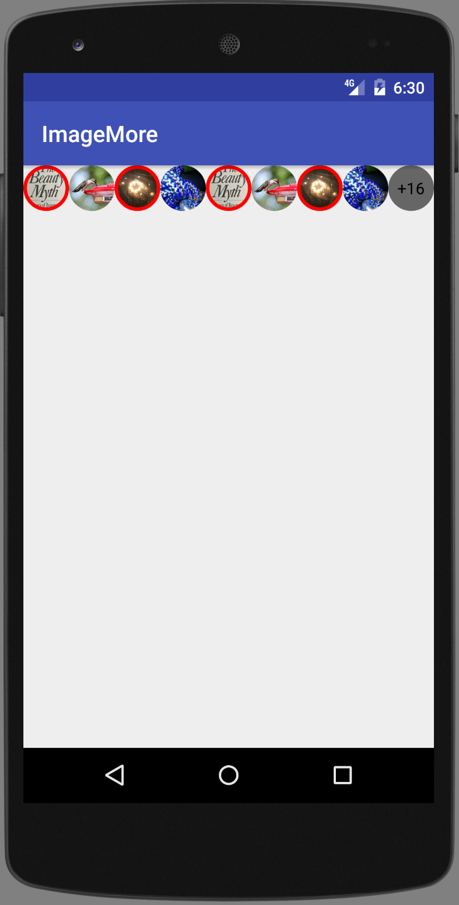

#ImageMore

A simple UI element for a long list of images which are not put on screen.
This element is calculating maximum visible childs count, depending on screen size.



## Usage

Declare in your layout:

```xml
        <com.applikeysolutions.imagemore.ImageMore
            android:id="@+id/imageMore"
            android:layout_width="match_parent"
            app:counterBackground="@drawable/round_counter"
            android:layout_height="40dp" />
```

Then just add links to images:

```java
        Image imageMore = (ImageMore) findViewById(R.id.imageMore);
        imageMore.addItem("https://images-na.ssl-images-amazon.com/images/I/7106mGW8G0L._CR0,204,1224,1224_UX128.jpg");
```

There are some attributes to customize:
```xml
        <attr name="minItemMargin" format="dimension" />
        <attr name="counterBackground" format="reference"/>
        <attr name="counterTextAppearance" format="reference"/>
```

**minItemMargin** is a minimum margin between elements.

**counterBackground** is a XML drawable for custom counter background

**counterTextAppearance** is a way to customize some of counter attributes(such as color, font, text size etc.)

See [sample](sample/src/main/java/com/applikeysolutions/imagemore/example/ImageMoreExampleActivity.java).

License
-----

	Licensed under the Apache License, Version 2.0 (the "License");
	you may not use this file except in compliance with the License.
	You may obtain a copy of the License at

	http://www.apache.org/licenses/LICENSE-2.0

	Unless required by applicable law or agreed to in writing, software
	distributed under the License is distributed on an "AS IS" BASIS,
	WITHOUT WARRANTIES OR CONDITIONS OF ANY KIND, either express or implied.
	See the License for the specific language governing permissions and
	limitations under the License.